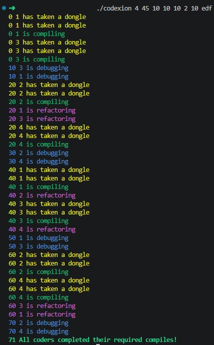

*This project has been created as part of the 42 curriculum by adaza-ru.*

<div align="center">

# Codexion

**A concurrency simulation in C — deadlock prevention, starvation-free scheduling, and precise deadline monitoring, reimagined from Dijkstra's Dining Philosophers.**


</div>

---

## Table of Contents

- [Overview](#overview)
- [Features](#features)
- [How It Works](#how-it-works)
- [Synchronization Design](#synchronization-design)
- [Getting Started](#getting-started)
- [Usage](#usage)
- [Testing](#testing)
- [Key Concepts Explored](#key-concepts-explored)
- [Resources](#resources)
- [Notes](#notes)

---

## Overview

Codexion is an evolution of the classic **Dining Philosophers problem**, originally introduced by **Edsger Dijkstra**. Instead of philosophers competing for forks, *coders* compete for **USB dongles** while racing to compile before hitting **burnout**.

Coders share a circular set of dongles. Each coder must acquire **two adjacent dongles** before compiling, releases them afterward, then debugs and refactors before trying to compile again. The simulation ends when every coder reaches the required number of compilations — or when a single coder burns out by missing its deadline.



Under the hood, it's a sandbox for a specific set of hard concurrency problems:

- Deadlock-free acquisition of shared resources
- Starvation-free scheduling under two different policies (FIFO / EDF)
- Deadline monitoring with microsecond-level precision
- Thread-safe, interleaving-free logging

## Features

**Simulation**
- One thread per coder, plus a dedicated monitor thread for burnout detection
- Circular dongle topology
- Dongle cooldown periods between release and next availability

**Scheduling**
- FIFO (First In, First Out)
- EDF (Earliest Deadline First)
- Priority queue implemented as a binary min-heap

**Reliability**
- Strict validation of all command-line arguments
- Serialized, interleaving-free output
- Graceful termination of every thread on simulation end
- Verified against memcheck, Helgrind, ThreadSanitizer, and AddressSanitizer

## How It Works

### Deadlock prevention

Coders acquire **both** required dongles atomically while holding the arbitrator mutex — a coder never holds one dongle while waiting for the other. This breaks the Coffman conditions directly:

| Condition | How it's avoided |
|---|---|
| Mutual exclusion | Dongles are exclusive, but access is centrally coordinated |
| Hold and wait | A coder never holds one dongle while waiting for another |
| No preemption | Dongles are never forcibly taken during compilation |
| Circular wait | Dongles are never acquired independently, so no cycle can form |

### Starvation prevention

Waiting coders sit in a priority heap ordered by arrival time (FIFO) or by burnout deadline (EDF). Condition variables wake waiting coders when dongles are released, and priority is **re-checked after every wake-up** — so no coder can permanently jump the queue.

### Dongle cooldown

Released dongles aren't immediately available again:

```
dongle_free_at = current_time + dongle_cooldown
```

### Burnout detection

A dedicated monitor thread continuously checks every coder's last compilation start time:

```
current_time - last_compile_start >= time_to_burnout
```

When this triggers, the monitor sets the termination flag and wakes every waiting thread so the simulation can shut down cleanly instead of hanging.

### Thread-safe logging

All output goes through a single `write_mutex`, so no two messages can interleave. Every state change is printed as:

```
timestamp coder_id action
```

## Synchronization Design

**Mutexes**

| Mutex | Responsibility |
|---|---|
| `arbitrator_mutex` | Dongle state, waiting heap, arrival sequence numbers, condition-variable coordination |
| `write_mutex` | Serializes all output |
| `end_mutex` | Protects the `simulation_end` flag |
| `state_mutex` | Protects each coder's `last_compile_start` and `compiles_done` |

**Condition variables**

Each coder has its own condition variable and waits on it when: one of its dongles is taken, one of its dongles is cooling down, or another waiting coder has higher priority. Waiting temporarily releases `arbitrator_mutex`, letting other threads make progress. On release, neighbors are woken with:

```c
pthread_cond_broadcast(&env->cond_coders[neighbor_id]);
```

**Coder ↔ monitor communication**

There's no dedicated event object — instead, event-style communication happens through shared state guarded by mutexes: coders update `last_compile_start` and `compiles_done`, the monitor reads both under `state_mutex` and writes `simulation_end` under `end_mutex`. Waiting coders are explicitly woken via condition variables when the simulation stops.

**Data structure**

The waiting queue is a **binary min-heap** in a fixed-size array, with the ordering key (arrival order vs. deadline) depending on the selected scheduler.

## Getting Started

### Requirements

- A C compiler
- POSIX threads (`pthread`)
- `make`

### Build

```bash
git clone https://github.com/adaza-ru/Codexion.git
cd codexion
make          # plain build
make color    # build with colored output
```

## Usage

```bash
./codexion <number_of_coders> <time_to_burnout> <time_to_compile> <time_to_debug> <time_to_refactor> <number_of_compiles_required> <dongle_cooldown> <scheduler>
```

| Argument | Description |
|---|---|
| `number_of_coders` | Number of coders and dongles (1–250) |
| `time_to_burnout` | Max time (ms) before a coder burns out |
| `time_to_compile` | Compilation duration (ms) |
| `time_to_debug` | Debugging duration (ms) |
| `time_to_refactor` | Refactoring duration (ms) |
| `number_of_compiles_required` | Compilations needed per coder to end the run successfully |
| `dongle_cooldown` | Time (ms) a released dongle stays unavailable |
| `scheduler` | `fifo` or `edf` |

**Example**

```bash
./codexion 6 800 200 100 100 3 100 edf
```

**Scheduling policies**

- `fifo` — served strictly in queue-entry order.
- `edf` — a coder's deadline is `last_compile_start + time_to_burnout`; the closest deadline goes first.

## Testing

```bash
make termtest           # quick, tool-free demo: errors + base behaviour
make logtest             # full matrix (memcheck / helgrind / tsan / asan) → logs/
make logtest-errors      # argument-validation matrix, under memcheck
make logtest-memcheck    # memcheck matrix only
make logtest-helgrind    # Helgrind matrix only
make logtest-tsan        # ThreadSanitizer matrix only
make logtest-asan        # AddressSanitizer matrix only
make clean / fclean / re # standard cleanup / rebuild
```

## Key Concepts Explored

- Deadlock avoidance via atomic multi-resource acquisition
- Starvation-free scheduling: FIFO vs. Earliest Deadline First
- Priority queues via binary heaps
- Deadline/timeout monitoring with a dedicated watcher thread
- Thread-safe I/O and shared-state coordination without a formal event object

## Resources

- [CodeVault — Unix Threads in C](https://www.youtube.com/playlist?list=PLfqABt5AS4FmuQf70psXrsMLEDQXNkLq2)
- *Modern Operating Systems*, 4th Edition — Andrew Tanenbaum (Ch. 2: Processes and Threads)
- *Operating Systems: Three Easy Pieces* — Remzi H. Arpaci-Dusseau & Andrea C. Arpaci-Dusseau
- [POSIX Threads documentation](https://pubs.opengroup.org/onlinepubs/9699919799/basedefs/pthread.h.html)
- [pthread_create(3)](https://man7.org/linux/man-pages/man3/pthread_create.3.html)
- [pthread_cond_wait(3)](https://man7.org/linux/man-pages/man3/pthread_cond_wait.3.html)
- [pthread_mutex_lock(3p)](https://man7.org/linux/man-pages/man3/pthread_mutex_lock.3p.html)
- [gettimeofday(2)](https://man7.org/linux/man-pages/man2/gettimeofday.2.html)

## Notes

Originally built as part of the 42 curriculum. AI tools were used as a review and learning aid — reviewing synchronization logic, checking FIFO/EDF behaviour, interpreting Valgrind/Helgrind output, and suggesting edge-case tests. All suggestions were reviewed, tested, and adapted by hand.
